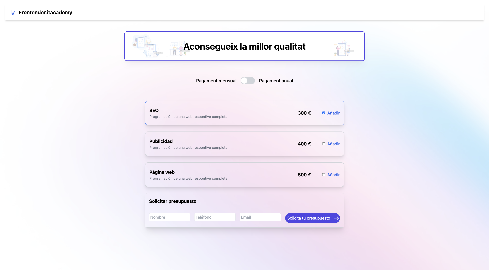
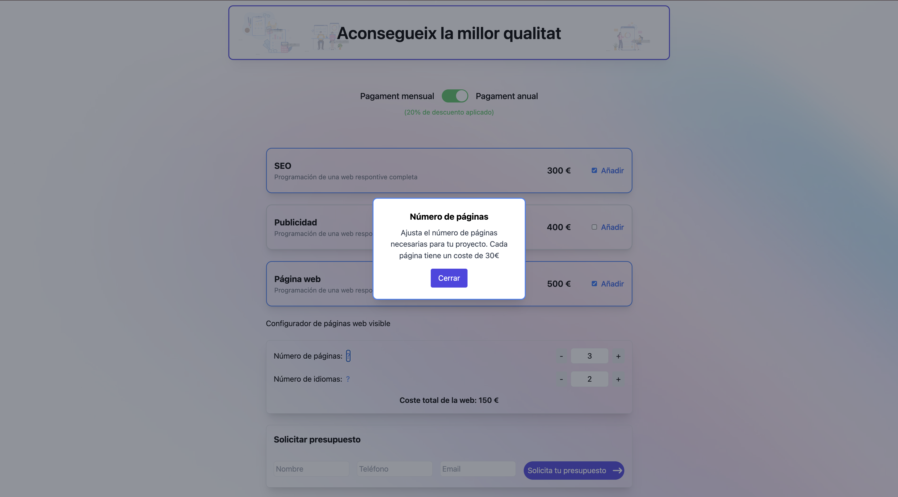

# Mi Proyecto

Este es un proyecto increíble. Aquí puedes ver cómo se ve la aplicación:

## Instrucciones de instalación

1. Clona este repositorio.
2. Instala las dependencias.
3. Ejecuta el proyecto.
